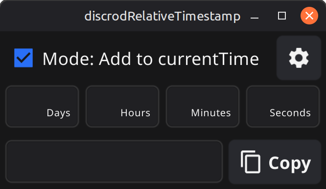
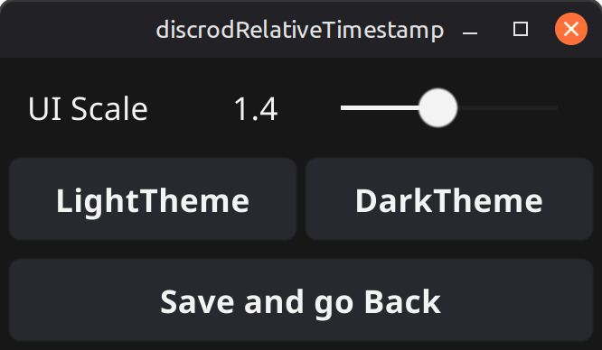

# discrodRelativeTimestamp
## Описание
Discord поддерживает специальный формат времени:
```text
<t:UNIX_TIMESTAMP:R>
```
После отправки такого тега Discord автоматически показывает относительное время:
```text
через 2 дня
через 5 часов
3 минуты назад
```

Меня задолбало каждый раз вручную считать Unix Timestamp через онлайн-конвертеры, поэтому я сделал свою программу для этой задачи.
Введи количество дней, часов, минут и секунд, нажми Copy — и готовый тег для Discord будет скопирован в буфер обмена.

| Main Screen                    | Settings                        |
| ------------------------------ | ------------------------------- |
|  |  |


### Возможности
- генерация относительных временных меток Discord;
- добавление времени к текущему моменту;
- копирование результата в один клик;
- светлая и тёмная темы;
- настройка масштаба интерфейса (UI Scale);
- минималистичный интерфейс;
- работает локально, без интернета.


## Запуск
Скачайте бинарник из Releases и запустите его.
Приложение не требует установки и работает локально.

## Используемые технологии
- golang
- fyne

## Version History
* 0.0: Проект создан
* 0.1: Двойное нажатие esc закрывает программу.
* 0.2: Всё готово. Слегка полирнуть, и в релиз.
* 1.0: Релиз.
